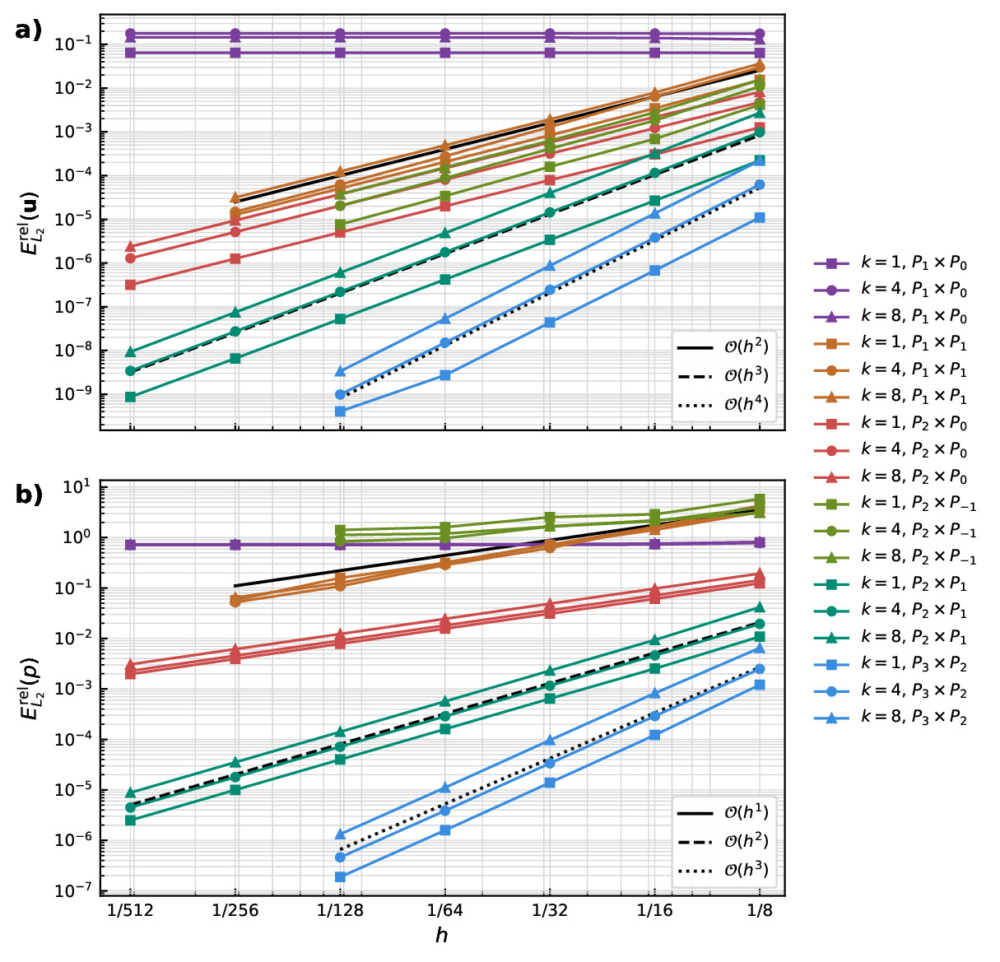
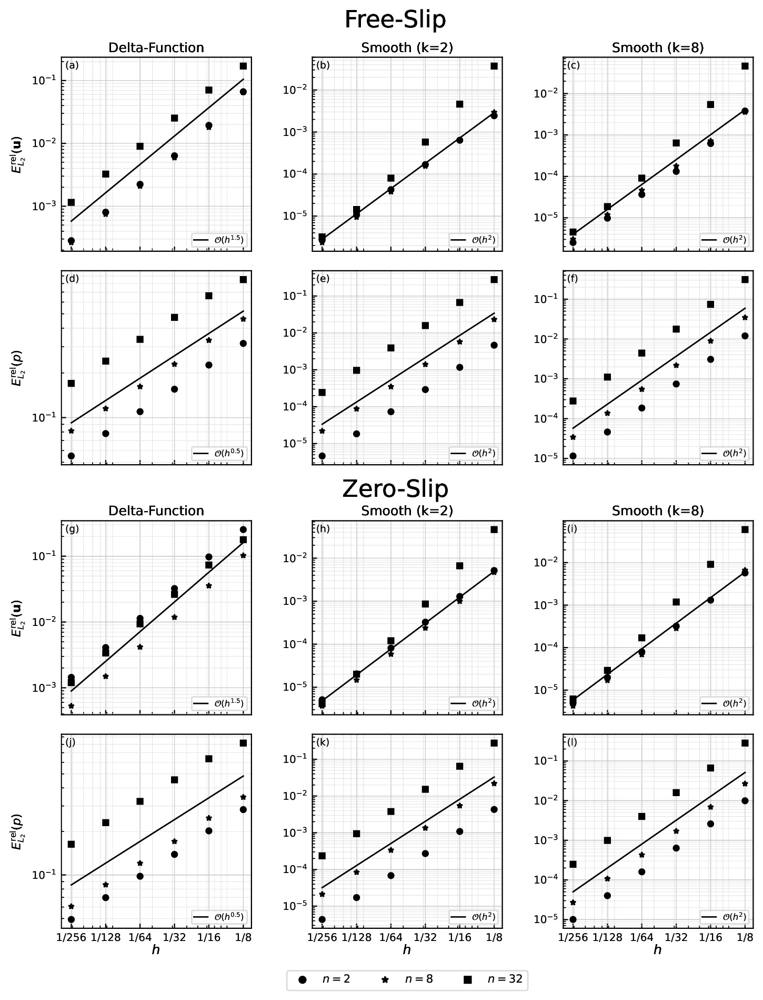
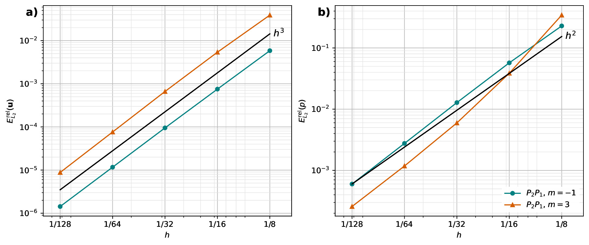
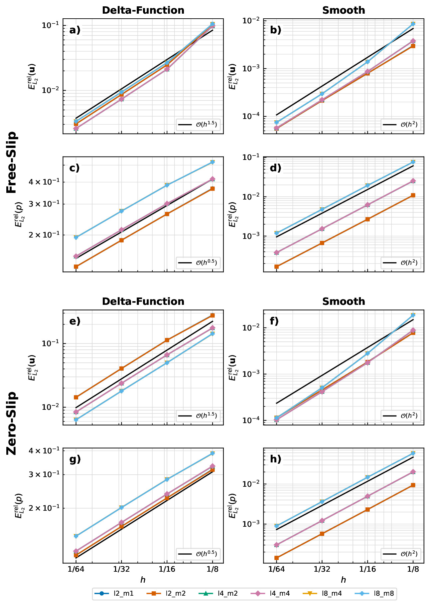
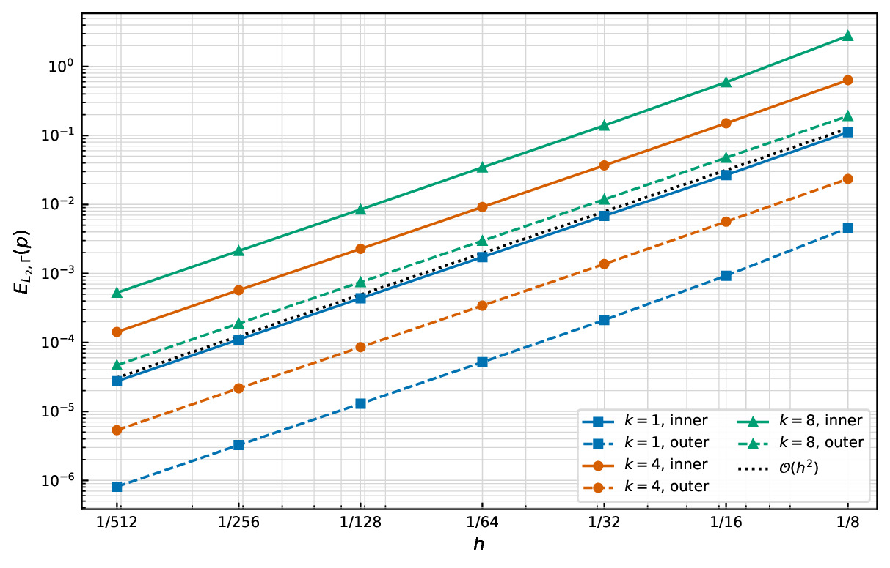
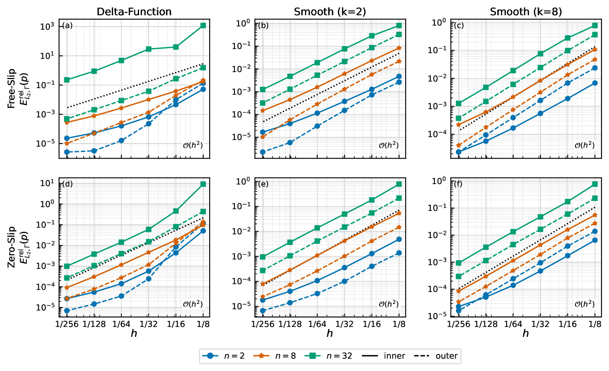
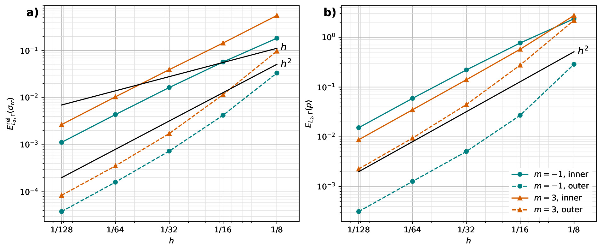
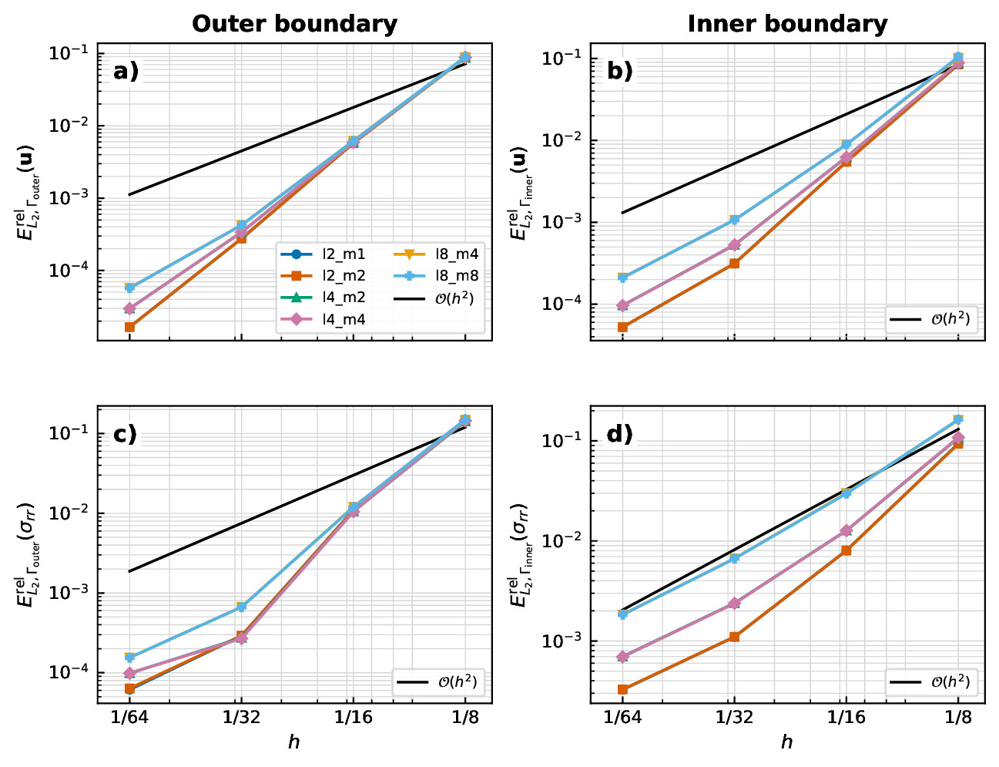

# Benchmarking Stokes Flow in Underworld3 Using Annulus and Spherical-Shell Geometries

<p align="justify">
This post introduces a suite of annulus and spherical-shell Stokes benchmarks reproduced using Underworld3.<sup><a href="#ref-1">1</a></sup> These benchmark problems have previously been implemented in several numerical codes, but here we bring them together within a single framework to highlight both the strengths and practical challenges of curved-domain finite-element modelling. The post is aimed at researchers working on geodynamics numerical modelling. Rather than focusing on heavy mathematical derivations or low-level implementation details, the goal is to provide an intuitive and practical guide to what each benchmark is designed to test, what numerical behaviour should be expected, and how to interpret the results. By the end, readers should have a clear understanding of the purpose of these benchmarks and the key ideas behind verifying Stokes flow in curved geometries.
</p>

## What Is Benchmarking and Why Is It Important?

<p align="justify">
Benchmarking is the process of testing a numerical method or software implementation against problems with known analytical solutions or well-established reference results. In computational geodynamics, benchmarks are essential because they help verify that a code correctly solves the governing equations before it is applied to complex Earth-science problems where the true solution is unknown. A good benchmark does more than produce a visually reasonable result; it tests numerical convergence behaviour, boundary-condition implementation, mesh geometry, and solver robustness under controlled conditions. Curved-domain benchmarks such as annulus and spherical-shell Stokes problems are particularly important because they expose numerical challenges that do not appear in simple Cartesian geometries. Successfully reproducing benchmark results therefore builds confidence that a numerical framework can model real-world problems with reliable and physically meaningful approximations.
</p>

## What Are the Stokes Equations?

<p align="justify">
The Stokes equations describe the slow, viscous flow of fluids in situations where inertial forces are negligible compared with viscous forces. In geodynamics, this approximation is widely used because rocks in the Earth's mantle deform extremely slowly over geological timescales and behave like highly viscous fluids. The incompressible Stokes equations are written as
</p>

```math
\begin{aligned}
-\nabla \cdot \left(2 \eta \dot{\varepsilon}(\mathbf{u})\right)
+ \nabla p &= \rho \mathbf{g}, \\
\nabla \cdot \mathbf{u} &= 0 .
\end{aligned}
```

<p align="justify">
Here <em>u</em> is velocity, <em>p</em> is pressure, <em>η</em> is viscosity, <em>ρ</em> is density, and <em>g</em> is gravity. The first equation represents conservation of momentum, balancing viscous stresses, pressure gradients, and body forces. The second equation enforces mass conservation through incompressibility. Solving these equations allows us to model mantle convection, lithospheric deformation, subduction, and many other large-scale Earth processes. Although the equations appear compact, solving them accurately in curved geometries with complex boundary conditions and variable material properties is computationally challenging, which is why benchmark problems are important.
</p>

## Why Do We Need Curved Geometries?

<p align="justify">
Curved geometries are important in geodynamics because the Earth itself is curved. Many large-scale Earth processes, such as mantle convection, subduction, plume dynamics, and lithospheric deformation, occur within spherical or shell-like domains rather than simple rectangular boxes. While Cartesian geometries are useful for developing intuition and testing numerical methods, they cannot fully represent radial gravity, curved boundaries, or global-scale flow patterns. Curved-domain models also introduce additional numerical challenges, including geometric approximation errors, coordinate transformations, and the accurate implementation of free-slip or zero-slip boundary conditions on non-planar surfaces. As a result, annulus and spherical-shell benchmarks provide a more realistic and demanding test of Stokes solvers.
</p>

## Benchmark Suite

<p align="justify">
In this work, we reproduce four widely used Stokes benchmark suites in curved geometries using Underworld3.<sup><a href="#ref-1">1</a></sup> The first is the Thieulot--Puckett annulus benchmark, which provides a smooth analytical solution in an annulus and is mainly used to test optimal finite-element convergence behaviour.<sup><a href="#ref-2">2</a></sup> The second is the Kramer annulus benchmark, which extends the problem to include both smooth volumetric forcing and singular delta-function forcing on an internal interface, together with free-slip and zero-slip boundary conditions.<sup><a href="#ref-3">3</a></sup> We then consider the spherical-shell counterparts of these problems: the Thieulot spherical benchmark, which tests smooth Stokes flow in spherical geometry with both constant and radially varying viscosity,<sup><a href="#ref-4">4</a></sup> and the Kramer spherical benchmark, which again introduces internal interface forcing and reduced solution regularity.<sup><a href="#ref-3">3</a></sup> Together, these four benchmark suites test curved geometries, pressure treatment, mesh approximation, boundary-condition implementation, smooth and singular forcing, and convergence behaviour in both two- and three-dimensional Stokes flow.
</p>

<p align="center">
  
</p>
<p align="center">
  <em>Analytical benchmark fields used in the annulus and spherical-shell Stokes benchmark suite. The panels collect the Thieulot--Puckett annulus, Kramer annulus, Thieulot spherical-shell, and Kramer spherical-shell cases.</em>
</p>

## What Do We Measure? Error Quantification

<p align="justify">
The benchmark comparisons use L<sub>2</sub>-norm errors because they give a single quantitative measure of the difference between the numerical solution and the analytical solution over the whole domain. For a computed field <em>q</em><sub>h</sub> and analytical field <em>q</em><sup>*</sup>, the absolute volume error is
</p>

```math
E_{L_2}(q)
=
\left(
\int_{\Omega} |q_h-q^*|^2\,\mathrm{d}\Omega
\right)^{1/2}.
```

<p align="justify">
The corresponding relative volume error is
</p>

```math
E_{L_2}^{\mathrm{rel}}(q)
=
\frac{E_{L_2}(q)}{\|q^*\|_{L_2}}
=
\left(
\frac{\int_{\Omega} |q_h-q^*|^2\,\mathrm{d}\Omega}
     {\int_{\Omega} |q^*|^2\,\mathrm{d}\Omega}
\right)^{1/2}.
```

<p align="justify">
The relative form is useful when comparing velocity and pressure errors across different benchmark cases because it normalises the error by the size of the analytical solution. For pressure, the numerical and analytical fields are first compared in the same pressure gauge, since incompressible Stokes pressure is determined only up to an additive constant.
</p>

<p align="justify">
Boundary pressure errors are measured separately on the inner and outer surfaces. For a boundary Γ ∈ {Γ<sub>inner</sub>, Γ<sub>outer</sub>}, the absolute pressure-trace error is
</p>

```math
E_{L_2,\Gamma}(p)
=
\left(
\int_{\Gamma} |p_h-p^*|^2\,\mathrm{d}\Gamma
\right)^{1/2}.
```

<p align="justify">
Where the analytical boundary pressure has a nonzero L<sub>2</sub> norm, the relative boundary pressure error is
</p>

```math
E_{L_2,\Gamma}^{\mathrm{rel}}(p)
=
\left(
\frac{\int_{\Gamma} |p_h-p^*|^2\,\mathrm{d}\Gamma}
     {\int_{\Gamma} |p^*|^2\,\mathrm{d}\Gamma}
\right)^{1/2}.
```

<p align="justify">
Convergence is measured by comparing errors across successively refined meshes:
</p>

```math
\mathrm{rate}
=
\frac{
\log\left(E_{h_1}/E_{h_2}\right)
}{
\log\left(h_1/h_2\right)
}.
```

<p align="justify">
Here <em>h</em> is the characteristic cell size. If the mesh is uniformly refined so that <em>h</em><sub>2</sub> = <em>h</em><sub>1</sub>/2, this becomes
</p>

```math
\mathrm{rate}
=
\log_2\left(\frac{E_{h_1}}{E_{h_2}}\right).
```

<p align="justify">
The expected behaviour is simple: as <em>h</em> decreases, the error should decrease. On a log-log convergence plot, a method with error proportional to <em>C h</em><sup>r</sup> appears approximately as a straight line with slope <em>r</em>. For smooth Stokes solutions, stable mixed finite-element pairs have well-defined optimal convergence expectations; for example, Taylor--Hood P<sub>2</sub> × P<sub>1</sub> commonly gives third-order velocity and second-order pressure convergence in the volume L<sub>2</sub> norm when the geometry and solution are sufficiently smooth.<sup><a href="#ref-5">5</a></sup> Singular forcing cases are different: the solution is less regular near the internal interface, so reduced convergence rates are expected even when the solver is implemented correctly.
</p>

## What Do We Observe? Results of Benchmarks in Underworld3

### Volumetric Convergence

<p align="justify">
The benchmark results show that Underworld3 reproduces the expected convergence behaviour for both annulus and spherical-shell Stokes problems. For smooth analytical solutions, such as the Thieulot annulus and spherical benchmarks, the Taylor--Hood P<sub>2</sub> × P<sub>1</sub> discretisation achieves close to the theoretically expected convergence rates, with approximately third-order velocity convergence and second-order pressure convergence in the volume L<sub>2</sub> norm. Higher-order element pairs further improve accuracy, while lower-order discretisations show the expected reduction in convergence order.
</p>

<p align="justify">
For the Kramer benchmarks with smooth forcing, the velocity convergence is closer to second order because the curved geometry is represented using linear meshes, consistent with the original benchmark studies.<sup><a href="#ref-3">3</a></sup> In the delta-function forcing cases, the convergence rates reduce significantly because the internal singular interface lowers the regularity of the analytical solution. Overall, the volumetric results demonstrate that Underworld3 captures both optimal convergence behaviour for smooth problems and the expected degradation in accuracy for singular forcing cases.
</p>

<p align="center">
  
</p>
<p align="center"><em>Velocity and pressure convergence for the Thieulot--Puckett annulus benchmark.</em></p>

<p align="center">
  
</p>
<p align="center"><em>Velocity and pressure convergence for the Kramer annulus benchmark.</em></p>

<p align="center">
  
</p>
<p align="center"><em>Velocity and pressure convergence for the Thieulot spherical-shell benchmark.</em></p>

<p align="center">
  
</p>
<p align="center"><em>Velocity and pressure convergence for the Kramer spherical-shell benchmark.</em></p>

### Boundary Pressure Convergence

<p align="justify">
Boundary diagnostics provide a more local and often more sensitive measure of solver accuracy in curved geometries. The volume pressure norm measures an error over the full domain, but boundary pressure errors isolate the pressure trace on the surfaces where boundary conditions, radial normal stresses, and traction-related diagnostics are evaluated. This is useful because geometric approximation errors and boundary quadrature errors can be more visible on curved inner and outer boundaries than in a volume-averaged metric.
</p>

<p align="justify">
For the Thieulot--Puckett annulus benchmark, the P<sub>2</sub> × P<sub>1</sub> boundary pressure errors decrease close to the expected O(<em>h</em><sup>2</sup>) trend. The inner and outer boundaries do not have identical error constants, which is acceptable: the two curves have different radii, different geometric representation errors, and different boundary integration paths.
</p>

<p align="center">
  
</p>
<p align="center"><em>Absolute boundary pressure error convergence for the Thieulot--Puckett annulus benchmark using the P<sub>2</sub> × P<sub>1</sub> discretisation. Solid curves denote the inner boundary and dashed curves denote the outer boundary.</em></p>

<p align="justify">
For the Kramer annulus benchmark, the boundary pressure errors converge close to second order for the smooth cases. The delta-function cases also show stronger boundary pressure convergence than the corresponding volume pressure norm because the reduced regularity is localized at the internal interface rather than on the annulus boundaries.
</p>

<p align="center">
  
</p>
<p align="center"><em>Relative boundary pressure error convergence for the Kramer annulus benchmark. Solid curves denote the inner boundary and dashed curves denote the outer boundary.</em></p>

<p align="justify">
The Thieulot spherical-shell benchmark gives the corresponding smooth three-dimensional boundary test. The boundary-pressure panel shows that the absolute pressure-trace errors for both <em>m</em> = -1 and <em>m</em> = 3 decrease systematically with refinement. These errors are shown together with radial normal-stress errors because the stress diagnostic combines pressure and velocity-gradient errors at the same curved spherical boundaries.
</p>

<p align="center">
  
</p>
<p align="center"><em>Boundary radial normal-stress and absolute boundary pressure error convergence for the Thieulot spherical-shell benchmark. The right panel shows E<sub>L2,Γ</sub>(p) on the inner and outer spherical boundaries.</em></p>

<p align="justify">
For the Kramer spherical-shell benchmark, the current boundary figure reports boundary velocity and radial normal-stress convergence for the free-slip delta-function case. A separate boundary pressure-trace convergence plot is not part of the current spherical Kramer article outputs. The radial normal-stress diagnostic is included here because it is pressure-sensitive: σ<sub>rr</sub> contains the pressure contribution and therefore tests pressure recovery together with velocity-gradient recovery on the spherical boundaries.
</p>

<p align="center">
  
</p>
<p align="center"><em>Boundary velocity and radial normal-stress convergence for the Kramer spherical-shell benchmark. This is the available pressure-sensitive boundary diagnostic for the spherical Kramer case.</em></p>

<p align="justify">
Overall, the boundary diagnostics complement the volume L<sub>2</sub> pressure errors. Smooth benchmark cases recover approximately second-order pressure-trace convergence for the P<sub>2</sub> × P<sub>1</sub> pair, while singular forcing primarily affects the volume pressure norm through reduced regularity at the internal interface. Persistent differences between inner- and outer-boundary error constants should therefore be interpreted as geometric and boundary-evaluation effects rather than as a failure of pressure normalisation.
</p>

<p align="justify">
The full details are in the article PDFs, which can be viewed directly from the <a href="https://github.com/gthyagi/UW3_Annulus_Spherical_Benchmarks/tree/main/docs/benchmarks_figures_and_articles">benchmark figures and articles directory on GitHub</a>:
</p>

- [Thieulot--Puckett annulus benchmark](https://github.com/gthyagi/UW3_Annulus_Spherical_Benchmarks/blob/main/docs/benchmarks_figures_and_articles/annulus/thieulot/thieulot_annulus_benchmark_article.pdf)
- [Kramer annulus benchmark](https://github.com/gthyagi/UW3_Annulus_Spherical_Benchmarks/blob/main/docs/benchmarks_figures_and_articles/annulus/kramer/kramer_annulus_benchmark_article.pdf)
- [Thieulot spherical-shell benchmark](https://github.com/gthyagi/UW3_Annulus_Spherical_Benchmarks/blob/main/docs/benchmarks_figures_and_articles/spherical/thieulot/thieulot_spherical_benchmark_article.pdf)
- [Kramer spherical-shell benchmark](https://github.com/gthyagi/UW3_Annulus_Spherical_Benchmarks/blob/main/docs/benchmarks_figures_and_articles/spherical/kramer/kramer_spherical_benchmark_article.pdf)

<p align="justify">
Those articles contain the analytical fields, discretisation choices, convergence tables, boundary diagnostics, and full reference details.
</p>

## References

1. <span id="ref-1"></span>Moresi, L., Mansour, J., Giordani, J., Knepley, M., Knight, B., Graciosa, J. C., Gollapalli, T., Lu, N., and Beucher, R.: Underworld3: Mathematically Self-Describing Modelling in Python for Desktop, HPC and Cloud, *Journal of Open Source Software*, 10, 7831, [https://doi.org/10.21105/joss.07831](https://doi.org/10.21105/joss.07831), 2025.
2. <span id="ref-2"></span>Thieulot, C. and Puckett, E. G.: Incompressible Stokes flow in an annulus: An analytical solution and numerical benchmark, preprint submitted to *Computers & Geosciences*, [https://www.math.ucdavis.edu/~egp/PUBLICATIONS/JOURNAL_ARTICLES/SUBMITTED/CAPT-EGP-2018.pdf](https://www.math.ucdavis.edu/~egp/PUBLICATIONS/JOURNAL_ARTICLES/SUBMITTED/CAPT-EGP-2018.pdf), 2018.
3. <span id="ref-3"></span>Kramer, S. C., Davies, D. R., and Wilson, C. R.: Analytical solutions for mantle flow in cylindrical and spherical shells, *Geoscientific Model Development*, 14, 1899--1919, [https://doi.org/10.5194/gmd-14-1899-2021](https://doi.org/10.5194/gmd-14-1899-2021), 2021.
4. <span id="ref-4"></span>Thieulot, C.: Analytical solution for viscous incompressible Stokes flow in a spherical shell, *Solid Earth*, 8, 1181--1191, [https://doi.org/10.5194/se-8-1181-2017](https://doi.org/10.5194/se-8-1181-2017), 2017.
5. <span id="ref-5"></span>Boffi, D., Brezzi, F., and Fortin, M.: *Mixed Finite Element Methods and Applications*, Springer Series in Computational Mathematics, Springer, [https://doi.org/10.1007/978-3-642-36519-5](https://doi.org/10.1007/978-3-642-36519-5), 2013.
