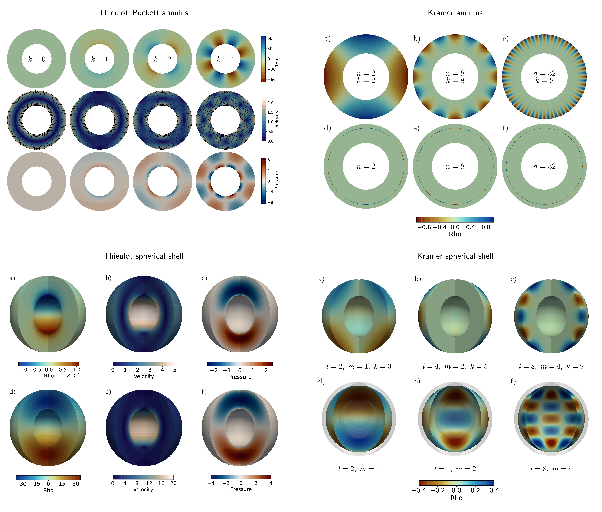
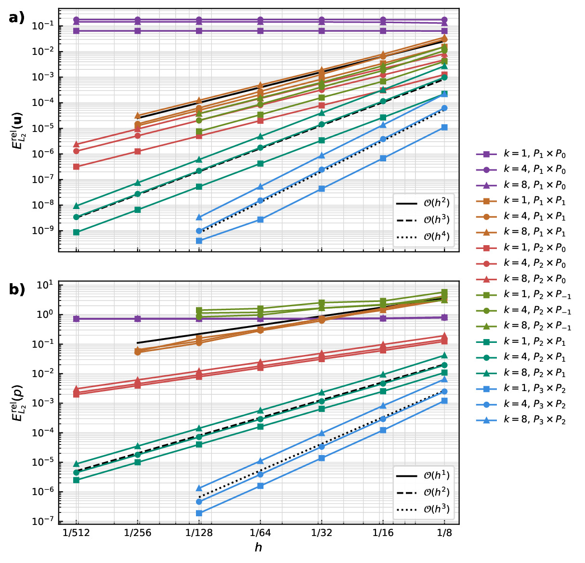
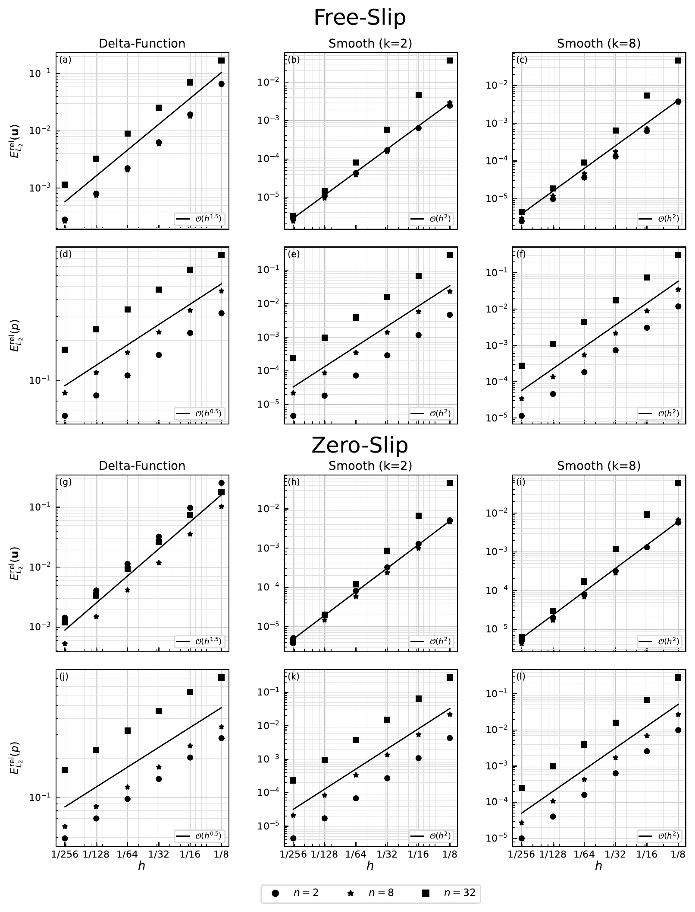
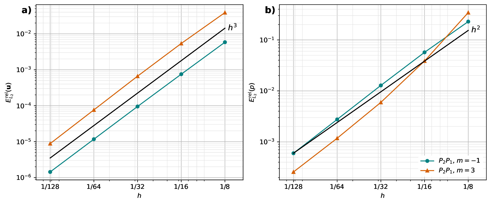
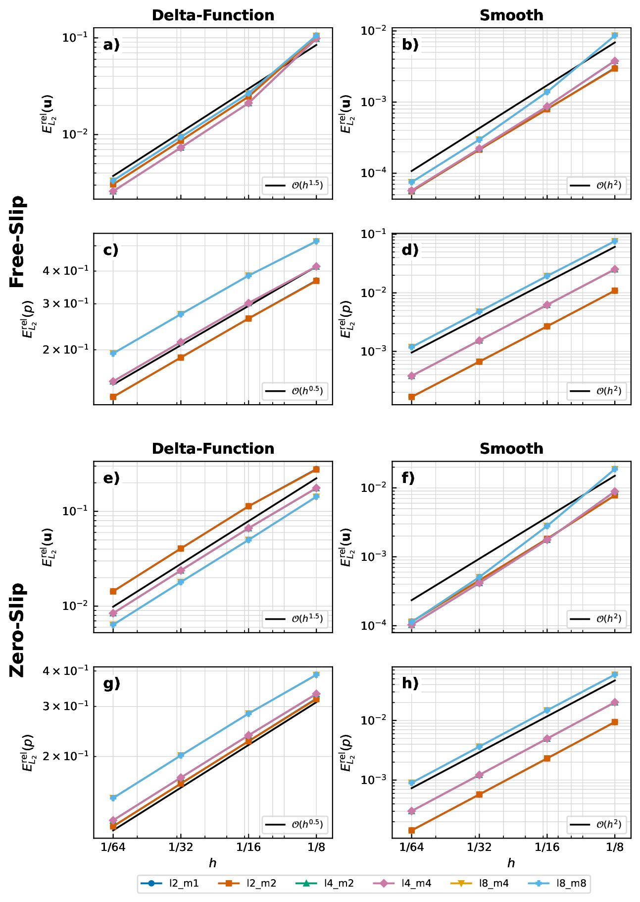
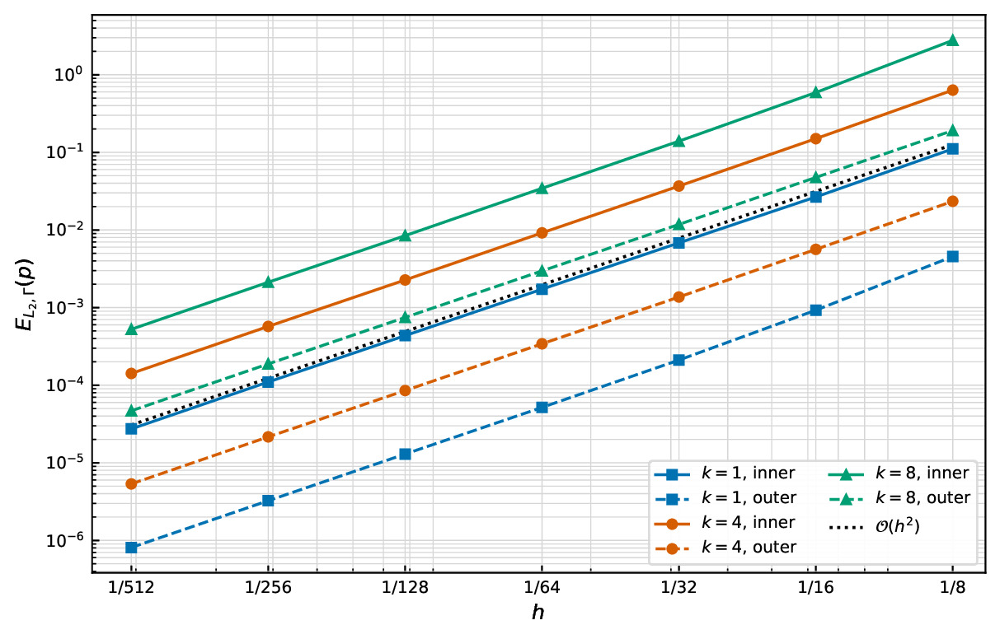
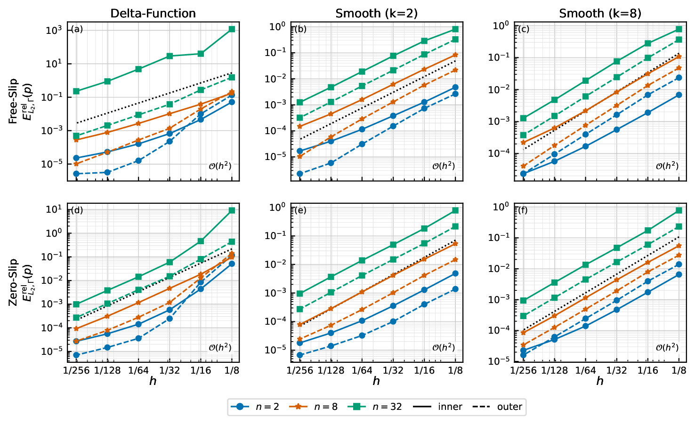
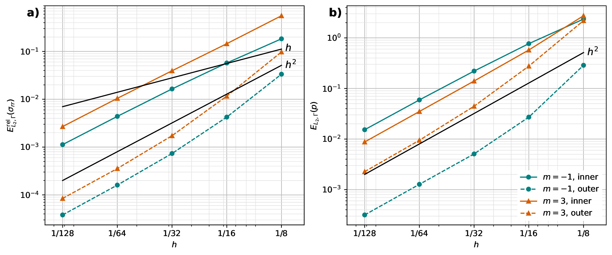
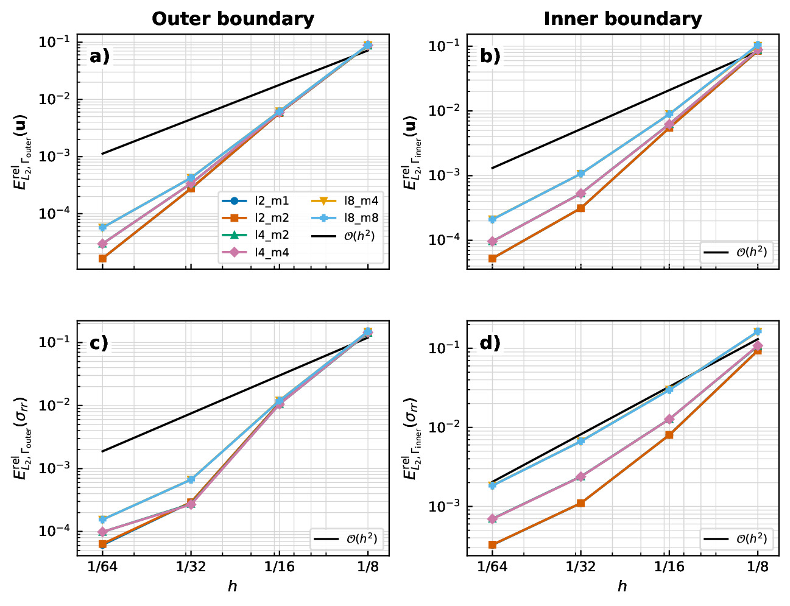

# Underworld3 Curved-Domain Stokes Benchmarks

Finite-element calculations of Stokes flow in an annulus or spherical shell involve both approximation of the velocity and pressure fields and representation of the curved domain. Their accuracy also depends on solution regularity and the imposed boundary conditions. Analytical solutions provide a reference against which these combined numerical errors can be measured as the mesh is refined.

This technical note evaluates Underworld3 (UW3)<a href="#ref-1">1</a> using four analytical Stokes benchmark families. It brings together volume velocity and pressure errors, boundary pressure errors, and radial normal-stress diagnostics to interpret the observed convergence. Smooth solutions permit assessment of the finite-element approximation orders, while delta-function forcing introduces an internal interface that limits solution regularity and reduces the expected rates. The emphasis is on the evidence provided by these complementary measures; the detailed benchmark articles contain the analytical derivations and complete convergence tables.

## Benchmark Problems and Numerical Objectives

On the domain $\Omega$, all benchmark cases satisfy the steady incompressible Stokes equations

$$
\begin{aligned}
-\nabla \cdot \boldsymbol{\sigma} &= \rho\mathbf{g}, \\
\nabla \cdot \mathbf{u} &= 0.
\end{aligned}
$$

The Cauchy stress and strain-rate tensors are defined by

$$
\begin{aligned}
\boldsymbol{\sigma}
&= -p\mathbf{I}+2\eta\boldsymbol{\varepsilon}(\mathbf{u}), \\
\boldsymbol{\varepsilon}(\mathbf{u})
&= \frac{1}{2}\left(\nabla\mathbf{u}+\nabla\mathbf{u}^{\mathsf{T}}\right).
\end{aligned}
$$

Here $\mathbf{u}$ is velocity, $p$ is pressure, $\eta$ is viscosity, $\rho$ is density, $\mathbf{g}$ is gravitational acceleration, and $\mathbf{I}$ is the identity tensor. The benchmark families differ in geometry, forcing regularity, viscosity, and velocity boundary conditions, providing complementary assessments of the spatial discretisation and boundary treatment.

| Benchmark | Geometry | Forcing and viscosity | Velocity boundary condition | Principal numerical assessment |
|---|---|---|---|---|
| Thieulot–Puckett annulus<a href="#ref-2">2</a> | Annulus | Smooth forcing; constant viscosity; harmonics $k=1,4,8$ | Analytical tangential velocity prescribed on both boundaries | Convergence hierarchy across several mixed finite-element pairs |
| Kramer annulus<a href="#ref-3">3</a> | Annulus | Smooth volumetric or delta-function interface forcing; constant viscosity | Free slip or zero slip | Effect of forcing regularity and boundary-condition type |
| Thieulot spherical shell<a href="#ref-4">4</a> | Spherical shell | Smooth forcing; constant viscosity for $m=-1$ and radial viscosity for $m=3$ | Analytical tangential velocity prescribed on both boundaries | Three-dimensional velocity, pressure, and boundary-stress convergence |
| Kramer spherical shell<a href="#ref-3">3</a> | Spherical shell | Smooth volumetric or delta-function interface forcing; constant viscosity | Free slip or zero slip | Regularity-limited convergence and spherical boundary diagnostics |

Figure 1. Analytical fields used by the Thieulot–Puckett annulus, Kramer annulus, Thieulot spherical-shell, and Kramer spherical-shell benchmarks.

## Spatial Discretisation and Solver Configuration

UW3 assembles the finite-element Stokes system from symbolic expressions, and PETSc solves the resulting saddle-point problem.<a href="#ref-7">7</a> Unstructured triangular and tetrahedral meshes are generated using Gmsh.<a href="#ref-6">6</a> The Kramer benchmarks and the Thieulot spherical-shell benchmark use the $P_2\times P_1$ Taylor–Hood pair, comprising continuous quadratic velocity and continuous linear pressure spaces.

The Thieulot–Puckett annulus study additionally compares $P_1\times P_0$, equal-order $P_1\times P_1$, $P_2\times P_0$, $P_2\times P_1^{\mathrm{disc}}$ (labelled $P_2\times P_{-1}$ in the figures), $P_2\times P_1$, and $P_3\times P_2$. An observed convergence slope for a single benchmark does not establish mixed-element stability. For pairs that are not uniformly inf–sup stable on the meshes considered here, the reported rates are empirical properties of the benchmark calculations rather than general stability guarantees.

Mesh resolution is parameterised by the Gmsh characteristic cell size $h$, which specifies a target local edge length rather than the measured maximum, minimum, or mean element diameter. Reducing $h$ from $1/8$ to $1/16$ generates an independent unstructured mesh with a smaller target size; it does not produce a nested refinement by subdividing every element of the coarser mesh. Geometric and element-quality constraints therefore yield a distribution of actual element sizes at each resolution. The annulus meshes also represent the curved boundaries with straight-sided facets, so the reported discretisation error includes a contribution from geometric approximation.

For the prescribed-velocity and impermeable free-slip boundary conditions considered here, pressure is determined only up to an additive constant. The numerical and analytical pressure fields are therefore placed in the same zero-mean gauge before their errors are evaluated:

$$
\begin{aligned}
p_h^{\circ}
&= p_h-\frac{1}{|\Omega|}\int_{\Omega}p_h\,\mathrm{d}\Omega, \\
p_*^{\circ}
&= p_*-\frac{1}{|\Omega|}\int_{\Omega}p_*\,\mathrm{d}\Omega.
\end{aligned}
$$

Here $|\Omega|$ denotes the domain area in the annulus and volume in the spherical shell. The same domain-wide pressure shift is used for both boundary-error evaluations.

The reported annulus calculations use a Stokes tolerance of $10^{-9}$; the spherical-shell calculations use $10^{-6}$. Run outputs record the mesh, element, solver, and process-count parameters. The benchmark implementations are available in the [annulus Thieulot](../../benchmarks/annulus/ex_stokes_thieulot.py), [annulus Kramer](../../benchmarks/annulus/ex_stokes_kramer.py), [spherical Thieulot](../../benchmarks/spherical/ex_stokes_thieulot.py), and [spherical Kramer](../../benchmarks/spherical/ex_stokes_kramer.py) scripts.

## Error Measures and Convergence Rates

### Volume Errors

For a numerical field $q_h$ and analytical field $q_*$, the absolute volume error is defined as

$$
E_{L_2}(q) = \left(
\int_{\Omega}\lVert q_h-q_*\rVert^2\,\mathrm{d}\Omega
\right)^{1/2},
$$

and the relative error, when the analytical norm is nonzero, is

$$
\begin{aligned}
E_{L_2}^{\mathrm{rel}}(q)
&= \frac{E_{L_2}(q)}{\lVert q_*\rVert_{L_2}} \\
&= \left(
\frac{\int_{\Omega}\lVert q_h-q_*\rVert^2\,\mathrm{d}\Omega}
     {\int_{\Omega}\lVert q_*\rVert^2\,\mathrm{d}\Omega}
\right)^{1/2}.
\end{aligned}
$$

The pointwise norm denotes absolute value for pressure and the Euclidean norm for velocity. For pressure, $q_h$ and $q_*$ denote the gauge-normalised fields defined above. Normalisation by the analytical $L_2$ norm permits comparisons among cases with different forcing amplitudes, whereas the absolute norm retains the scaling associated with both the field and the integration domain.

### Boundary Errors

To assess boundary accuracy directly, pressure is evaluated separately on the inner and outer boundaries. For either boundary $\Gamma$, the absolute pressure-trace error is

$$
E_{L_2,\Gamma}(p) = \left(
\int_{\Gamma}|p_h^{\circ}-p_*^{\circ}|^2\,\mathrm{d}\Gamma
\right)^{1/2}.
$$

Where the analytical boundary pressure has a nonzero $L_2$ norm, the relative measure is

$$
E_{L_2,\Gamma}^{\mathrm{rel}}(p) = \left(
\frac{\int_{\Gamma}|p_h^{\circ}-p_*^{\circ}|^2\,\mathrm{d}\Gamma}
     {\int_{\Gamma}|p_*^{\circ}|^2\,\mathrm{d}\Gamma}
\right)^{1/2}.
$$

The absolute boundary norm includes the boundary measure $|\Gamma|$, which is a length in the annulus and an area in the spherical shell. Thus, different inner and outer absolute errors can partly reflect different integration measures. A boundary root-mean-square error removes this factor:

$$
E_{\mathrm{RMS},\Gamma}(p)
= \frac{E_{L_2,\Gamma}(p)}{\sqrt{|\Gamma|}}.
$$

This normalisation permits comparison of the average error magnitude on the two boundaries. The absolute and relative norms in the figures retain their stated definitions.

### Convergence Rates

The observed convergence rate between successive target cell sizes is

$$
r = \frac{\log(E_{h_1}/E_{h_2})}
     {\log(h_1/h_2)}.
$$

For the nominal halving used here, this reduces to

$$
r=\log_2\left(\frac{E_h}{E_{h/2}}\right).
$$

Here $E_h$ denotes the same error measure evaluated at each resolution. On log–log axes, $E_h\simeq Ch^r$ has slope $r$; halving $h$ reduces the error by approximately $2^r$ within that regime. For a sufficiently smooth Stokes solution, a stable $P_2\times P_1$ Taylor–Hood discretisation can attain third-order velocity and second-order pressure convergence in the volume $L_2$ norm under the usual regularity assumptions, provided that geometry, quadrature, boundary treatment, and solver error do not limit the rate.<a href="#ref-5">5</a> Delta-function interface forcing reduces solution regularity and lowers the expected asymptotic rates. Departures from the smooth-solution orders must therefore be interpreted against the regularity of each benchmark.

## Volume-Error Convergence

### Thieulot–Puckett Annulus

The smooth Thieulot–Puckett solution provides a direct assessment of the convergence hierarchy associated with increasing polynomial degree. The stable $P_2\times P_1$ Taylor–Hood pair gives approximately $O(h^3)$ velocity and $O(h^2)$ pressure convergence, while $P_3\times P_2$ approaches $O(h^4)$ and $O(h^3)$ before saturation at the finest resolutions. The piecewise-constant pressure space limits the $P_2\times P_0$ pressure error to approximately first-order convergence. The equal-order and discontinuous-pressure curves provide additional empirical results, but their slopes do not establish uniform inf–sup stability.

Figure 2. Relative volume velocity and pressure errors for the Thieulot–Puckett annulus benchmark. Curves compare the tested mixed finite-element pairs for $k=1,4,8$; reference lines show the smooth-solution orders.

### Kramer Annulus

The Kramer annulus results are governed primarily by forcing regularity rather than by the distinction between free-slip and zero-slip boundary conditions. Smooth forcing gives approximately second-order velocity and pressure convergence over the available resolutions. Delta-function forcing reduces the asymptotic trends to approximately $O(h^{1.5})$ for velocity and $O(h^{0.5})$ for pressure, consistent with the regularity limits derived for an internal singular interface.<a href="#ref-3">3</a> The $n=32$ cases exhibit a longer pre-asymptotic regime because fewer elements resolve each azimuthal wavelength.

Figure 3. Relative volume errors for the Kramer annulus benchmark. Rows separate free-slip and zero-slip cases; columns separate delta-function forcing from smooth forcing with $k=2$ and $k=8$. Symbols denote $n=2,8,32$.

### Thieulot Spherical Shell

The Thieulot spherical-shell benchmark extends the Taylor–Hood convergence assessment to three dimensions. Between $h=1/64$ and $1/128$, the observed velocity rates are 3.03 for $m=-1$ and 3.11 for $m=3$, while the pressure rate is 2.20 in both cases. The radially varying-viscosity solution exhibits greater pressure variation at coarse resolution, but both cases approach the expected asymptotic behaviour under refinement.

Figure 4. Relative volume velocity and pressure errors for the $P_2\times P_1$ Thieulot spherical-shell benchmark. The $m=-1$ case has constant viscosity, whereas $m=3$ has radially varying viscosity.

### Kramer Spherical Shell

The Kramer spherical-shell results retain the distinction between smooth and singular forcing, but the smooth velocity convergence exhibits a systematic limitation. Smooth pressure converges close to $O(h^2)$, whereas smooth velocity rates remain predominantly between 1.9 and 2.1 rather than attaining the ideal $O(h^3)$ $P_2$ rate reported for the curved/isoparametric Fluidity meshes of Kramer et al.<a href="#ref-3">3</a> The present calculations establish this difference but do not isolate its origin. Potential contributions include linear geometry, boundary-condition enforcement, quadrature, mesh quality, and interactions among these factors. The delta-function cases approach the expected regularity-limited rates of $O(h^{1.5})$ for velocity and $O(h^{0.5})$ for pressure.

Figure 5. Relative volume errors for the $P_2\times P_1$ Kramer spherical-shell benchmark. Rows separate free-slip and zero-slip cases; columns separate delta-function and smooth forcing. Colours denote the tested spherical harmonics.

## Boundary Pressure and Normal-Stress Convergence

Volume-error convergence alone does not establish boundary accuracy. Errors near a boundary may contribute relatively little to a domain integral, while boundary pressure and stress remain quantities of interest in their own right. The pressure trace measures the boundary restriction of the pressure field. Radial normal stress additionally involves velocity derivatives:

$$
\begin{aligned}
\sigma_{rr}
&= \mathbf{e}_r\cdot\boldsymbol{\sigma}\mathbf{e}_r \\
&= -p+2\eta\,\mathbf{e}_r\cdot
\boldsymbol{\varepsilon}(\mathbf{u})\mathbf{e}_r.
\end{aligned}
$$

Here $\mathbf{e}_r$ is the radial unit vector. Errors in $\sigma_{rr}$ combine pressure and velocity-gradient contributions, which cannot be separated from the stress norm alone. The reported stress and boundary-velocity errors use the same absolute or relative $L_2$ definitions with the corresponding field substituted for pressure.

### Annulus Pressure Traces

For the Thieulot–Puckett annulus, the $P_2\times P_1$ boundary pressure error converges at approximately second order. Differences between the inner and outer error constants may reflect boundary length, analytical pressure variation, local mesh geometry, and quadrature. The available curves do not separate these contributions. Their similar convergence rates indicate comparable orders of boundary-pressure accuracy, without requiring equal absolute error magnitudes.

Figure 6. Absolute pressure-trace errors for the $P_2\times P_1$ Thieulot–Puckett annulus benchmark. Solid curves denote the inner boundary and dashed curves the outer boundary.

The smooth Kramer annulus cases also approach second-order boundary pressure convergence. For delta-function forcing, the boundary pressure trace can converge faster than the corresponding volume pressure norm. This behaviour is consistent with localisation of the singular forcing on an internal interface, although elliptic coupling, boundary geometry, quadrature, and pressure-trace approximation also contribute. The available results demonstrate the difference in convergence behaviour but do not isolate a single controlling mechanism.

Figure 7. Relative inner- and outer-boundary pressure errors for the Kramer annulus benchmark. Rows separate free-slip and zero-slip cases; columns separate delta-function and smooth forcing.

### Spherical-Shell Boundary Diagnostics

For the Thieulot spherical shell, pressure-trace errors decrease systematically on both boundaries for $m=-1$ and $m=3$. The $\sigma_{rr}$ metric is more demanding because it combines pressure error with velocity-derivative error. Inner and outer values also differ through their surface areas, analytical amplitudes, local facets, and quadrature weights. The results quantify this asymmetry but do not identify a dominant contribution.

Figure 8. Relative radial normal-stress errors and absolute pressure-trace errors for the $P_2\times P_1$ Thieulot spherical-shell benchmark. Solid and dashed curves denote the inner and outer boundaries.

The Kramer spherical-shell boundary results report velocity and radial normal stress for the free-slip delta-function case; a separate pressure-trace norm is not included. The $\sigma_{rr}$ metric remains sensitive to pressure but also includes velocity-gradient error and must therefore be interpreted as a coupled stress diagnostic.

Figure 9. Boundary velocity and radial normal-stress convergence for the free-slip, delta-function Kramer spherical-shell benchmark. This is a pressure-sensitive stress diagnostic, not a pressure-trace error.

## Summary

The smooth Thieulot solutions recover the expected Taylor–Hood convergence hierarchy. The $P_2\times P_1$ pair gives approximately third-order velocity and second-order pressure convergence, while the annulus $P_3\times P_2$ pair approaches fourth- and third-order rates. The delta-function Kramer solutions recover the lower rates permitted by the reduced interface regularity, approximately $O(h^{1.5})$ for velocity and $O(h^{0.5})$ for pressure.

The smooth Kramer cases exhibit approximately second-order pressure convergence, while velocity remains closer to second than third order over the reported resolutions. Boundary pressure and normal-stress results provide additional evidence beyond the volume norms, although their interpretation depends on the quantity measured and the boundary normalisation. Together, these comparisons identify both the recovered convergence orders and the remaining departures from smooth-solution expectations.

## Limitations

The results apply to the reported mesh sequences, finite-element pairs, boundary treatments, and solver tolerances. These calculations do not independently quantify geometry, quadrature, boundary-enforcement, and algebraic-solver errors. In particular, the cause of the reduced smooth Kramer velocity rate remains unresolved. A controlled comparison of linear and curved/isoparametric geometry, with consistent solver accuracy and quadrature, would help assess the geometric contribution.

The Kramer spherical-shell study also requires a separate pressure-trace calculation because the current normal-stress metric combines pressure and velocity-gradient errors. Differences between inner and outer boundary errors likewise cannot be assigned quantitatively to individual mechanisms from the present convergence curves alone.

## Detailed Benchmark Articles

The complete analytical definitions, convergence tables, and discussion are provided in the benchmark articles:

- [Thieulot–Puckett annulus benchmark](https://github.com/gthyagi/UW3_Annulus_Spherical_Benchmarks/blob/main/docs/benchmarks_figures_and_articles/annulus/thieulot/thieulot_annulus_benchmark_article.pdf)
- [Kramer annulus benchmark](https://github.com/gthyagi/UW3_Annulus_Spherical_Benchmarks/blob/main/docs/benchmarks_figures_and_articles/annulus/kramer/kramer_annulus_benchmark_article.pdf)
- [Thieulot spherical-shell benchmark](https://github.com/gthyagi/UW3_Annulus_Spherical_Benchmarks/blob/main/docs/benchmarks_figures_and_articles/spherical/thieulot/thieulot_spherical_benchmark_article.pdf)
- [Kramer spherical-shell benchmark](https://github.com/gthyagi/UW3_Annulus_Spherical_Benchmarks/blob/main/docs/benchmarks_figures_and_articles/spherical/kramer/kramer_spherical_benchmark_article.pdf)

## References

1. Moresi, L., Mansour, J., Giordani, J., Knepley, M., Knight, B., Graciosa, J. C., Gollapalli, T., Lu, N., and Beucher, R.: Underworld3: Mathematically Self-Describing Modelling in Python for Desktop, HPC and Cloud, *Journal of Open Source Software*, 10, 7831, [https://doi.org/10.21105/joss.07831](https://doi.org/10.21105/joss.07831), 2025.
2. Thieulot, C. and Puckett, E. G.: Incompressible Stokes flow in an annulus: An analytical solution and numerical benchmark, preprint submitted to *Computers & Geosciences*, [https://www.math.ucdavis.edu/~egp/PUBLICATIONS/JOURNAL_ARTICLES/SUBMITTED/CAPT-EGP-2018.pdf](https://www.math.ucdavis.edu/~egp/PUBLICATIONS/JOURNAL_ARTICLES/SUBMITTED/CAPT-EGP-2018.pdf), 2018.
3. Kramer, S. C., Davies, D. R., and Wilson, C. R.: Analytical solutions for mantle flow in cylindrical and spherical shells, *Geoscientific Model Development*, 14, 1899–1919, [https://doi.org/10.5194/gmd-14-1899-2021](https://doi.org/10.5194/gmd-14-1899-2021), 2021.
4. Thieulot, C.: Analytical solution for viscous incompressible Stokes flow in a spherical shell, *Solid Earth*, 8, 1181–1191, [https://doi.org/10.5194/se-8-1181-2017](https://doi.org/10.5194/se-8-1181-2017), 2017.
5. Boffi, D., Brezzi, F., and Fortin, M.: *Mixed Finite Element Methods and Applications*, Springer Series in Computational Mathematics, Springer, [https://doi.org/10.1007/978-3-642-36519-5](https://doi.org/10.1007/978-3-642-36519-5), 2013.
6. Geuzaine, C. and Remacle, J.-F.: Gmsh: A 3-D finite element mesh generator with built-in pre- and post-processing facilities, *International Journal for Numerical Methods in Engineering*, 79, 1309–1331, [https://doi.org/10.1002/nme.2579](https://doi.org/10.1002/nme.2579), 2009.
7. Balay, S., Abhyankar, S., Adams, M. F., Benson, S., Brown, J., Brune, P., Buschelman, K., Constantinescu, E. M., Dalcin, L., Dener, A., Eijkhout, V., Faibussowitsch, J., Gropp, W. D., Hapla, V., Isaac, T., Jolivet, P., Karpeev, D., Kaushik, D., Knepley, M. G., and others: PETSc/TAO Users Manual, ANL-21/39 Rev. 3.21, Argonne National Laboratory, [https://doi.org/10.2172/2337606](https://doi.org/10.2172/2337606), 2024.
