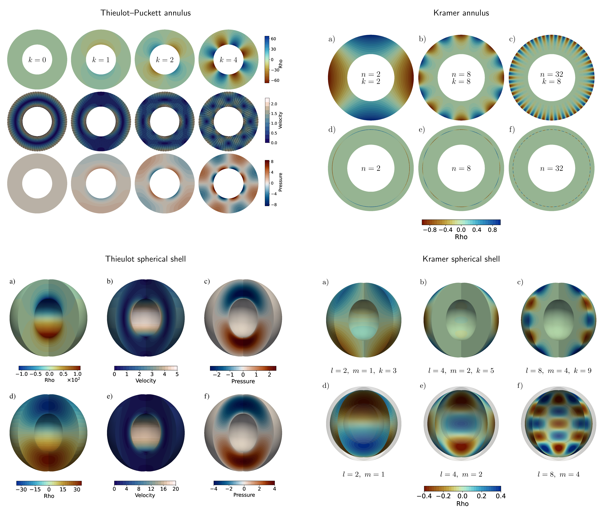

# Benchmarking Stokes Flow in Underworld3 Using Annulus and Spherical-Shell Geometries

This post introduces a suite of annulus and spherical-shell Stokes benchmarks reproduced using Underworld3. These benchmark problems have previously been implemented in several numerical codes, but here we bring them together within a single framework to highlight both the strengths and practical challenges of curved-domain finite-element modelling. The post is aimed at researchers working on geodynamics numerical modelling. Rather than focusing on heavy mathematical derivations or low-level implementation details, the goal is to provide an intuitive and practical guide to what each benchmark is designed to test, what numerical behaviour should be expected, and how to interpret the results. By the end, readers should have a clear understanding of the purpose of these benchmarks and the key ideas behind verifying Stokes flow in curved geometries.

## What Is Benchmarking and Why Is It Important?
Benchmarking is the process of testing a numerical method or software implementation against problems with known analytical solutions or well-established reference results. In computational geodynamics, benchmarks are essential because they help verify that a code correctly solves the governing equations before it is applied to complex Earth-science problems where the true solution is unknown. A good benchmark does more than produce a visually reasonable result — it tests numerical solution convergence behaviour, boundary-condition implementation, mesh geometry, and solver robustness under controlled conditions. Curved-domain benchmarks such as annulus and spherical-shell Stokes problems are particularly important because they expose numerical challenges that do not appear in simple Cartesian geometries. Successfully reproducing benchmark results therefore builds confidence that a numerical framework can model real-world problems with reliable and physically meaningful approximations.

## What are the Stokes Equations?
The Stokes equations describe the slow, viscous flow of fluids in situations
where inertial forces are negligible compared to viscous forces. In
geodynamics, this approximation is widely used because rocks in the Earth’s
mantle deform extremely slowly over geological timescales and behave like
highly viscous fluids. The incompressible Stokes equations are written as

$$
\begin{aligned}
-\nabla \cdot \left(2 \eta \dot{\varepsilon}(\mathbf{u})\right)
+ \nabla p &= \rho \mathbf{g}, \\
\nabla \cdot \mathbf{u} &= 0 .
\end{aligned}
$$

where $\mathbf{u}$ is velocity, $p$ is pressure, $\eta$ is viscosity,
$\rho$ is density, and $\mathbf{g}$ is gravity. The first equation
represents conservation of momentum, balancing viscous stresses, pressure
gradients, and body forces, while the second equation enforces mass
conservation through incompressibility. Solving these equations allows us to
model mantle convection, lithospheric deformation, subduction, and many other
large-scale Earth processes. Although the equations appear compact, solving
them accurately in curved geometries with complex boundary conditions and
variable material properties is computationally challenging, which is why
benchmark problems are important for verifying numerical implementations.

## Why do We Need Curved Geometries?
Curved geometries are important in geodynamics because the Earth itself is curved. Many large-scale Earth processes, such as mantle convection, subduction, plume dynamics, and lithospheric deformation, occur within spherical or shell-like domains rather than simple rectangular boxes. While Cartesian geometries are useful for developing intuition and testing numerical methods, they cannot fully represent radial gravity, curved boundaries, or global-scale flow patterns. Curved-domain models also introduce additional numerical challenges, including geometric approximation errors, coordinate transformations, and the accurate implementation of free-slip or tangential boundary conditions on non-planar surfaces. As a result, annulus and spherical-shell benchmarks provide a more realistic and demanding test of Stokes solvers, helping ensure that numerical methods remain accurate and robust in geometries relevant to real-world geodynamic applications.

## Benchmark Suite
In this work, we reproduce four widely used Stokes benchmark suites in curved geometries using Underworld3. The first is the Thieulot–Puckett annulus benchmark, which provides a smooth analytical solution in a two-dimensional cylindrical shell and is mainly used to test optimal finite-element convergence behaviour. The second is the Kramer annulus benchmark, which extends the problem to include both smooth volumetric forcing and singular delta-function forcing on an internal interface, together with free-slip and no-slip boundary conditions. We then consider the three-dimensional spherical-shell counterparts of these problems: the Thieulot spherical benchmark, which tests smooth Stokes flow in spherical geometry with both constant and radially varying viscosity, and the Kramer spherical benchmark, which again introduces internal interface forcing and reduced solution regularity. Together, these four benchmark suites test a wide range of numerical challenges, including curved geometries, pressure treatment, mesh approximation, boundary-condition implementation, smooth and singular forcing, and convergence behaviour in both two- and three-dimensional Stokes flow problems.

<figure>
  
  <figcaption>Analytical benchmark fields used in the annulus and spherical-shell Stokes verification suite. The panels collect the Thieulot--Puckett annulus, Kramer annulus, Thieulot spherical-shell, and Kramer spherical-shell cases.</figcaption>
</figure>

## What Do We Observe? Results of Benchmarks in Underworld3

### Volumetric Convergence

The benchmark results show that Underworld3 reproduces the expected
convergence behaviour for both annulus and spherical-shell Stokes problems.
For smooth analytical solutions, such as the Thieulot annulus and spherical
benchmarks, the Taylor--Hood $P_2 \times P_1$ discretisation achieves close
to the theoretically expected convergence rates, with approximately
third-order velocity convergence and second-order pressure convergence in the
volume $L_2$ norm. Higher-order element pairs further improve accuracy,
while lower-order discretisations show the expected reduction in convergence
order. For the Kramer benchmarks with smooth forcing, the velocity
convergence is closer to second order because the curved geometry is
represented using linear meshes, consistent with the observations reported in
the original benchmark studies. In the delta-function forcing cases, the
convergence rates reduce significantly because the internal singular interface
lowers the regularity of the analytical solution. Overall, the volumetric
results demonstrate that Underworld3 correctly captures both optimal
convergence behaviour for smooth problems and the expected degradation in
accuracy for singular forcing cases.

### Boundary Convergence

The boundary diagnostics provide an additional and often more sensitive
measure of solver accuracy in curved geometries. In these benchmarks,
quantities such as pressure and velocity are evaluated directly along the
inner and outer boundaries of the annulus or spherical shell. The results
show that Underworld3 accurately reproduces the analytical boundary behaviour
while correctly enforcing free-slip and no-slip conditions on curved
surfaces. Boundary convergence is particularly important because small
geometric or discretisation errors can accumulate near curved interfaces and
boundaries even when the volume solution appears accurate. The benchmark
results indicate that higher-order discretisations generally improve boundary
accuracy, while singular forcing cases remain more challenging due to sharp
pressure jumps and reduced solution smoothness near internal interfaces.
These boundary tests therefore provide strong evidence that the curved-domain
finite-element implementation in Underworld3 is robust and suitable for
realistic geodynamic modelling applications.

The full details are in the article PDFs:

- [Thieulot--Puckett annulus benchmark](../annulus/thieulot/thieulot_annulus_benchmark_article.pdf)
- [Kramer annulus benchmark](../annulus/kramer/kramer_annulus_benchmark_article.pdf)
- [Thieulot spherical-shell benchmark](../spherical/thieulot/thieulot_spherical_benchmark_article.pdf)
- [Kramer spherical-shell benchmark](../spherical/kramer/kramer_spherical_benchmark_article.pdf)

Those articles contain the analytical fields, discretisation choices,
convergence tables, boundary diagnostics, and references.

## References

- Boffi, D., Brezzi, F., and Fortin, M. (2013). *Mixed Finite Element Methods
  and Applications*. Springer.
- Kramer, S. C., Davies, D. R., and Wilson, C. R. (2021). Analytical solutions
  for mantle flow in cylindrical and spherical shells. *Geoscientific Model
  Development*, 14, 1899--1919.
- Moresi, L. et al. (2025). Underworld3: Mathematically Self-Describing
  Modelling in Python for Desktop, HPC and Cloud. *Journal of Open Source
  Software*, 10, 7831.
- Thieulot, C. (2017). Analytical solution for viscous incompressible Stokes
  flow in a spherical shell. *Solid Earth*, 8, 1181--1191.
- Thieulot, C. and Puckett, E. G. (2018). Incompressible Stokes flow in an
  annulus: an analytical solution and numerical benchmark.
